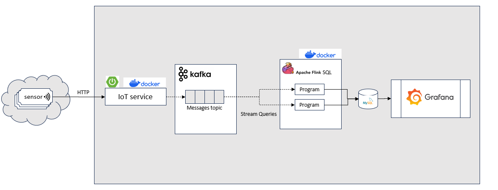

# Anomaly Detection for IoT sensors Application

This application runs streams analysis on IoT sensors data and alert on anomaly behaviours, The technology stack includes Kafka and Flink SQL with microservices architectural.

You need Docker and Docker-Compose installed to run this.

# Architectural Diagram

## Services Description:
* ***IoT Service*** 
* ***Detection Service*** 

Todo:
- Grafana:load dashboard
- Mysql: load .sql
- readme